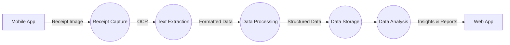

# Expense Reporting Automation

Automating the process of capturing and extracting information from receipts to streamline expense reporting and enhance user experience.

## Table of Contents

- [Project Description](#project-description)
- [Key Features](#key-features)
- [Workflow](#workflow)
- [How to Install and Run the Project](#how-to-install-and-run-the-project)
- [How to Use the Project](#how-to-use-the-project)
- [Credits](#credits)
- [License](#license)

## Project Description

This project aims to automate the manual and time-consuming process of expense reporting. By leveraging Optical Character Recognition (OCR) technology and image processing algorithms, receipt images can be converted into machine-readable text. An AI-driven module then extracts relevant information such as merchant names, transaction dates, amounts, and itemized expenses. The system also incorporates automatic categorization, verification checks, real-time feedback mechanism, and seamless integration with expense management software. Mobile accessibility and centralized storage ensure flexibility and efficiency in managing receipts. Continuous improvement is achieved through machine learning capabilities and user feedback.

## Key Features

- **Optical Character Recognition (OCR) Integration:** Implement OCR technology to convert receipt images into machine-readable text.
- **Image Processing:** Develop algorithms for image processing to enhance the quality of receipt images.
- **Data Extraction Module:** Create an AI-driven module for extracting relevant information from receipts, including merchant names, transaction dates, amounts, and itemized expenses.
- **Automatic Categorization:** Implement a feature for automatically categorizing expenses based on the extracted information.
- **Verification and Validation Checks:** Integrate validation checks to ensure accuracy and compliance with company expense policies.
- **Real-time Feedback Mechanism:** Design a feedback mechanism for providing real-time alerts to users regarding potential errors or missing data.
- **Integration with Expense Management Software:** Seamless integration with existing expense management software (e.g., SAP Concur) to auto-populate expense reports.
- **Mobile Accessibility:** Ensure the system works seamlessly on mobile devices, allowing users to capture receipts using smartphones.
- **Centralized Storage and Retrieval:** Create a centralized repository for storing and retrieving captured receipts, supporting auditing and reimbursement processes.
- **Learning and Improvement:** Incorporate machine learning capabilities for continuous improvement based on user corrections and feedback.

## Workflow

1. **Initiation**: Project kick-off, team alignment, and requirement clarification.
2. **Development Sprints**: Iterative development with regular sprint reviews and adjustments.
3. **Testing and Quality Assurance**: Comprehensive testing at each development stage to ensure functionality and reliability.
4. **Integration**: Integration with external systems, especially expense management software.
5. **User Acceptance Testing (UAT)**: Involvement of end-users for testing the system in a real-world environment.
6. **Deployment**: Gradual deployment to ensure minimal disruption to users.
7. **Post-Implementation Review**: Evaluation of the project's success, addressing any post-deployment issues.

## How to Install and Run the Project

1. Clone this repository: `git clone https://github.com/example/repo.git`.
2. Install the required dependencies: `npm install`.
3. Configure the necessary environment variables.
4. Start the application: `npm start`.

## How to Use the Project

1. Capture a receipt using the mobile app or upload an image file.
2. The OCR technology will convert the receipt image into machine-readable text.
3. The data extraction module will extract relevant information from the receipt.
4. Make any necessary corrections or additions to the extracted information.
5. Review and categorize the expense.
6. Submit the expense report or integrate with existing expense management software.

## Credits

This project was developed by the following developers:

- John Doe ([GitHub](https://github.com/johndoe), [Twitter](https://twitter.com/johndoe))
- Jane Smith ([GitHub](https://github.com/janesmith), [LinkedIn](https://www.linkedin.com/in/janesmith))

Special thanks to XYZ tutorial for their helpful insights during the project development.

## License

This project is licensed under the [MIT License](LICENSE).